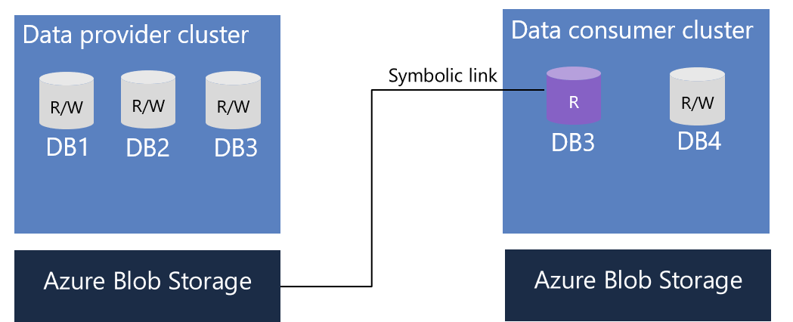

# How Azure Data Explorer in-place sharing works

This article describes how in-place sharing works for Azure Data Explorer (ADX).

## Share data from ADX cluster
Azure Data Share supports the ability to share databases from ADX cluster. Data provider can choose to share specifc database(s) or share at the cluster level. When specific database(s) are shared, data consumer will only see the database(s) shared. When sharing is done at the cluster level, data consumer can see all the databases from the provider's cluster, including any future databases created by the data provider. 

Databases are shared to data consumer in-place, which means data 

Data shared from SQL-based sources contains schema and data only. Azure Data Share does not preserve any pre-existing constraints defined on a table or view. Data is shared as a snapshot of the table or view at the time that a snapshot is generated. Azure Data Share does not support incremental copy.

Scheduled incremental copies are not supported for SQL-based sharing. If a snapshot is scheduled, a snapshot of the table as it exists on the originators SQL Server is generated at each scheduled or manual trigger. This means that each time a snapshot is triggered, the full contents of the table are brought across rather than just the delta since the last copy. 

### Receive SQL-based data in Azure Data Lake Store Gen2 or Azure Storage
Data consumers are able to receive SQL-based data into Azure Data Lake Store Gen2 or Azure Storage. By default, Azure Data Share enables customers to specify a storage location into which they will receive data into. Data is copied into a storage location specified by the data consumer when configuring the data share. Note that the contents of the origin table are copied into a format chosen by the data consumer and any previous data copied is overwritten when a new snapshot is generated. Azure Data Share currently supports receiving data in CSV or Parquet format. 

## Next steps

- Learn how to share data from Azure SQL Database or Azure SQL Data Warehouse - [SQL-based sharing](share-your-sql-data.md)
