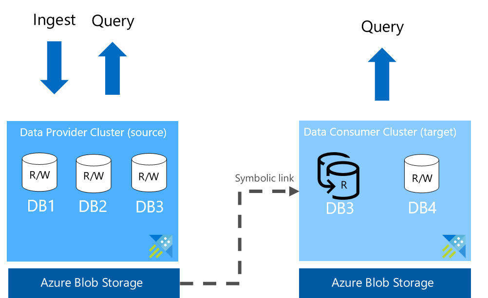

# How Azure Data Explorer in-place sharing works

Azure Data Share supports the ability to share databases in-place from ADX clusters. Data provider can share at the database or cluster level. When shared at database level, data consumer will only be able to access the specific database(s) shared by the data provider. When shared at cluster level, data consumer can access all the databases from the provider's cluster, including any future databases created by the data provider. 

To access shared databases, data consumer needs to have its own ADX cluster. Data consumer's ADX cluster needs to locate in the same Azure Data Center as the data provider's ADX cluster. When sharing relationship is established, Azure Data Share creates a symbolic link between the  provider and consumer's ADX clusters. 

Data consumer can only read or query the data, but not write to the shared databases. Data consumer can configure its own access and caching policies to the shared databases, as well as view logs of its own query. When data consumer accesses the data, it uses resources from the consumer's ADX cluster. Data may be cahed in the consumer's ADX cluster for improved query performance, but is not copied to the blob storage powering the consumer's ADX cluster. When data provider revokes access, symbolic link is deleted, and the shared database(s) are no longer available to the data consumer.

Azure Data Explorer supports two modes of data ingestion: batch and streaming. Data received from batch in the shared database will appear between a few seconds to a few minutes on the consumer side. Data received from streaming could take up to 24 hours to appear on the consumer side. When data provider shares a database of the same name as an existing database in the consumer's ADX cluster, the shared database will not show up on the consumer side.

## Next steps

- Learn how to [share data from Azure Data Explorer](share-your-adx-data.md)
