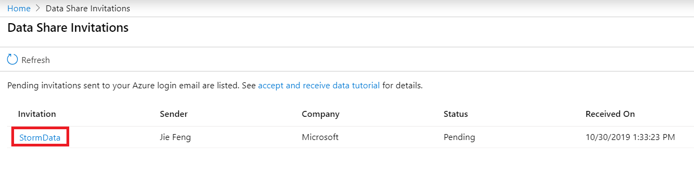
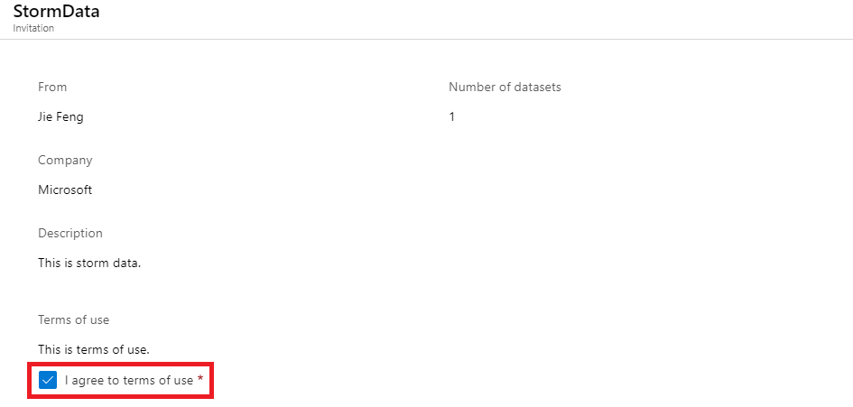
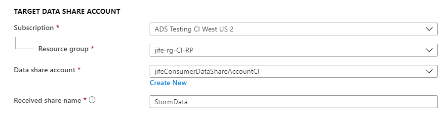
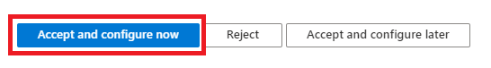

# Tutorial: Receive data in Azure Data Explorer cluster 

In this tutorial you will learn how to receive databases shared from one Azure Data Explorer cluster in another Azure Data Explorer cluster following these steps:

* Accept a Data Share Invitation
* Specify an Azure Data Explorer cluster to access shared data. 

## Prerequisites

* Azure Subscription: If you don't have an Azure subscription, create a [free account](https://azure.microsoft.com/free/) before you begin.
* An Azure Data Explorer cluster to receive data into.
* A Data Share Invitation from your Data Provider.
* Permission to add role assignment to your Azure Data Explorer resource. This permission exists in Owner role.

## Sign in to the Azure portal

Sign in to the [Azure portal](https://portal.azure.com/).

## Open invitation

Check your inbox for an invitation from your data provider. The invitation is from Microsoft Azure, titled **Azure Data Share invitation from <yourdataprovider@domain.com>**. Take note of the share name to ensure you're accepting the correct share if there are multiple invitations. 

Select on **View invitation** to see your invitation in Azure. This takes you to your Data Share Invitations view.

 

Select the invitation you would like to view. 

## Accept and configure
1. Review all the fields in the invitation, If you agree to the **Terms of use**, check *I agree to the terms of use*. 

     

1. Under *Target Data Share Account*, select the Subscription and Resource Group that you'll be deploying your Data Share into. 

For the **Data Share Account** field, select **Create new** if you don't have an existing Data Share account. Otherwise, select an existing Data Share account that you'd like to accept your data share into. 

For the *Received Share Name* field, you may leave the default specified by the Data Provide, or specify a new name for the received share. 

 

1. Click **Accept and Configure** to accept the invitation. If you don't want to accept the invitation, select *Reject*. 

 

## Map datasets to an Azure SQL Database or Data Warehouse
Navigate to Data Share -> Received Shares on the left side panel and select the share that you accepted. 

You will need to specify a destination for each dataset, which represents a table or a view that has been shared with you by the data provider. This can be done by selecting the dataset and selecting "+ Map to target".

On the right hand side, a new pane will be displayed. Select the Target data type you'd like to map to, and fill out all corresponding fields to designate a database or data warehouse to receive data into. 

You are now ready to receive data into your SQL Server. 

## Trigger a snapshot

You can trigger a snapshot in the Received Shares -> Details tab by selecting **Trigger snapshot**. Here, you can trigger a full snapshot only. Note that we do not support incremental copy for SQL-based data sources. Each time a snapshot is triggered, it will be the full copy of the originators table or view. 

 

When the last run status is *successful*, check your SQL Server to ensure that the table(s) and/or view(s) appear in your database. 
