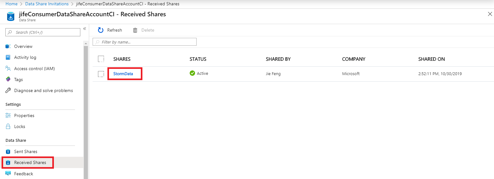
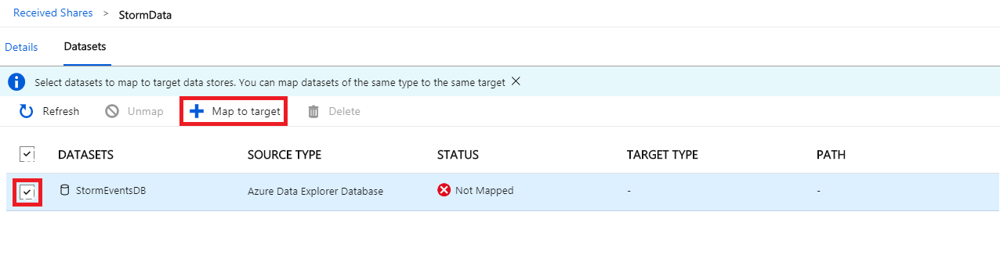
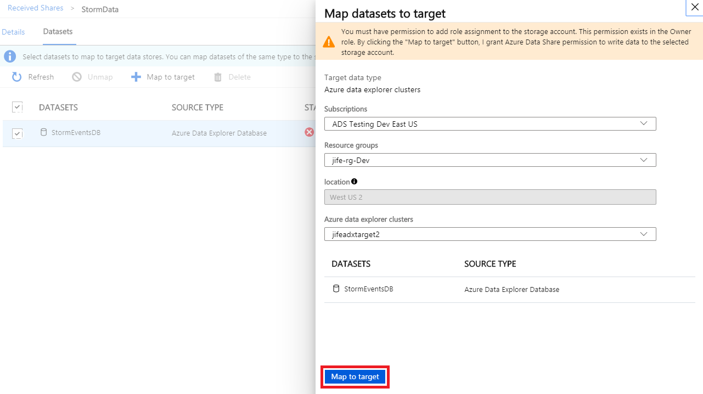
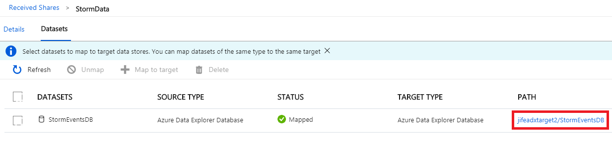
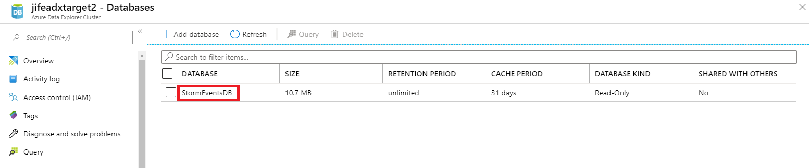
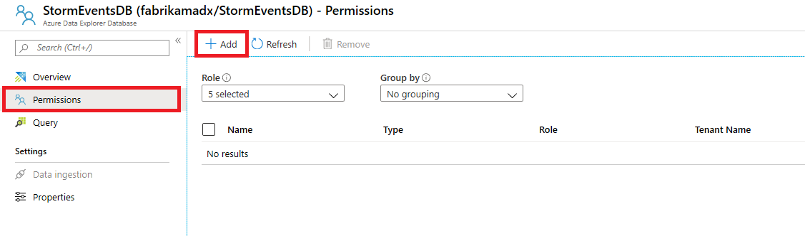

# Tutorial: Receive data in Azure Data Explorer cluster 

In this tutorial you will learn how to receive databases shared from one Azure Data Explorer cluster in another Azure Data Explorer cluster following these steps:

* Accept a Data Share Invitation
* Specify an Azure Data Explorer cluster to access shared data. 

## Prerequisites

* Azure Subscription: If you don't have an Azure subscription, create a [free account](https://azure.microsoft.com/free/) before you begin.
* A Data Share Invitation from your Data Provider.
* An Azure Data Explorer cluster to receive data into. Note the Azure Data Explorer cluster needs to be in the same Azure Data Center as the source Azure Data Explorer cluster where the data is shared from. When configuring received share in the step below, you will see the location of the source Azure Data Explorer cluster.
* Owner permission to the Azure Data Explorer cluster.

## View and Accept Invitation

1. Check your inbox for an invitation from your data provider. The invitation is from Microsoft Azure, titled **Azure Data Share invitation from <yourdataprovider@domain.com>**. Click on the link **View invitation**. This takes you to Azure login screen.

      

1. Sign in to the [Azure portal](https://portal.azure.com/). This takes you to your Data Share Invitations view. Select the invitation you would like to view. 

      

1. Review all the fields in the invitation, If you agree to the **Terms of use**, check *I agree to the terms of use*. 

      

1. Under *Target Data Share Account*, select your Data Share resource which you like to accept the invitation into. You can filter by Azure Subscription and Resource Group. If you don't have a Data Share resource, click **Create new** to create a Data Share resource. 

    For the *Received Share Name* field, you may leave the default specified by the Data Provide, or specify a new name for the received share. 

      

1. Click **Accept and Configure** to accept the invitation. If you don't want to accept the invitation, select *Reject*. 

      

## Configure Received Share
1. Navigate to Data Share resource which you have accepted the invitation into.  Select **Received Shares** on the left side panel and select the share that you accepted. 

      

1. Click **Dataset** tab. You will need to specify a target Azure Data Explorer cluster for each dataset. This can be done by selecting the dataset and selecting **Map to target**. You can select multiple datasets and map them to the same target as long as the source datasets are of the same type and are in the same Azure data centers or locations. 

      

1. On the right hand side, a new pane will be displayed. Select an Azure Data Explorer cluster to receive the data. Select **Map to target**. The Azure Data Explorer cluster you specify must be in the same location as the source cluster where data is shared from. If you do not have an Azure Data Explorer cluster in the same location as the source cluster, please follow the instructions in the [Create an Azure Data Explorer Cluster and Database](https://docs.microsoft.com/azure/data-explorer/create-cluster-database-portal) documentation to create one, and then continue. Please note you will need to be owner of the Azure Data Explorer cluster in order to receive data into the cluster.

      

1. Once mapping is successful, you can configure permission to the shared database. Select the path next to the dataset to open Azure Data Explorer cluster.
      

1. You should see the shared databases in your Azure Data Explorer cluster. Click on the database.
    
      
    
1. The permission field will show up as empty. Select **Permission**, click **Add**. Follow the steps in [Manage Azure Data Explorer database perissions](https://docs.microsoft.com/en-us/azure/data-explorer/manage-database-permissions) documentation to add permission to the database.

    
    
You can now query the data in the shared database.
    
## Troubleshoot
To troubleshoot data sharing issues, refer to [Troubleshoot common issues](troubleshoot-adx-sharing.md).
