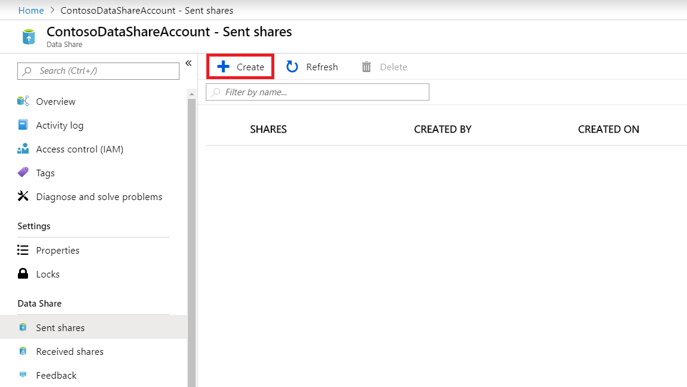
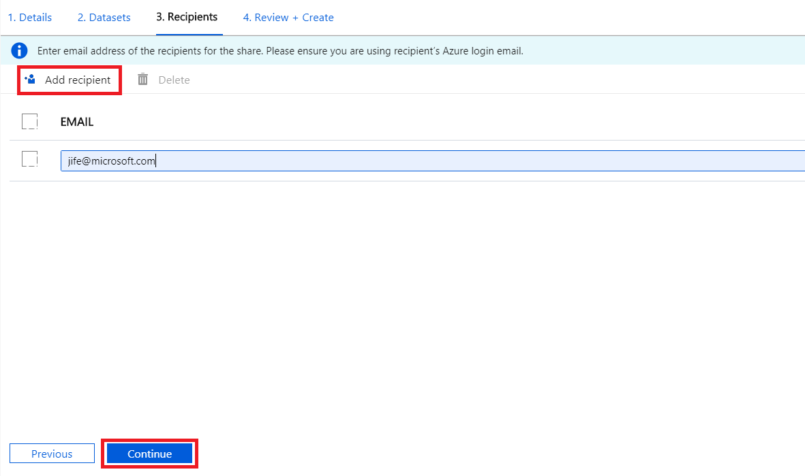

# Tutorial: Share data from Azure Data Explorer

In this tutorial, you will learn how to set up a new Azure Data Share resource and start sharing data from your Azure Data Explorer (ADX) cluster with your partners and customers following these steps:

* Create a Data Share resource.
* Create a share.
    * Add ADX databases your share.
    * Add recipients to your share. 

## Prerequisites

* Azure Subscription: If you don't have an Azure subscription, create a [free account](https://azure.microsoft.com/free/) before you begin.
* An Azure Data Explorer cluster with databases that you want to share.
* Your data consumer's Azure login e-mail address (using their e-mail alias will not work)
* Permission to add role assignment to your Azure Data Explorer resource. This permission exists in Owner role. 

## Sign in to the Azure portal

Sign in to the [Azure portal](https://portal.azure.com/).

## Create an Azure Data Share

Create an Azure Data Share resource in an Azure resource group.

1. Select the **Create a resource** button (+) in the upper-left corner of the  portal.

1. Search for *Data Share*.

1. Select *Data Share* and Select **Create**.

1. Fill out the basic details of your Azure Data Share resource with the following information. 

     **Setting** | **Suggested value** | **Field description**
    |---|---|---|
    | Name | *datashareacount* | Specify a name for your data share resource. |
    | Subscription | Your subscription | Select the Azure subscription that you want to use for your data share account.|
    | Resource group | *test-resource-group* | Use an existing resource group or create a new resource group. |
    | Location | *East US 2* | Select a region for your data share resource.
    | | |

1. Select **Create** to provision your data share resource. Provisioning a new data share resource typically takes about 2 minutes or less. 

1. When the deployment is complete, select **Go to resource**.

## Create a Share

1. Navigate to your Data Share Overview page and select **Start sharing your data**.

     

1. Select **Create**.   

    

1. Fill out the details for your Data Share. Specify a name, share type (select *In-place*), description, and optionally terms of use. 

     

1. Select **Continue**

1. To add Datasets to your Data Share, select **Add Datasets**. 

    

1. Select the dataset type *Azure Data Explorer*.

1. Navigate to the object you would like to share and select 'Add Datasets'. 

        

1. In the Recipients tab, enter in the email addresses of your Data Consumer by selecting '+ Add Recipient'. 

     

1. Select **Continue**

1. In the Review + Create tab, review your Share Contents, Settings and Recipients. Select **Create**

    

Your Share has now been created and the recipient of your Data Share is now ready to accept your invitation. 

    

## Next steps

To learn about how a Data Consumer can accept and receive a share, continue to the [accept and receive ADX data](receive-adx-data.md) tutorial. 

